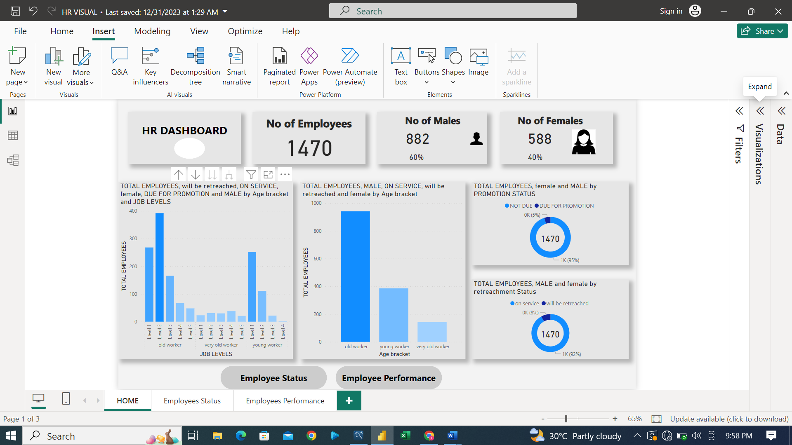
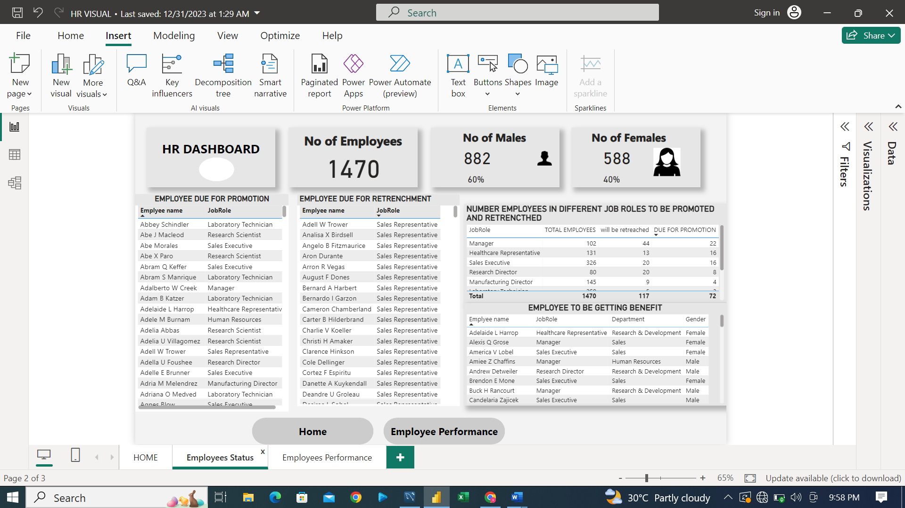
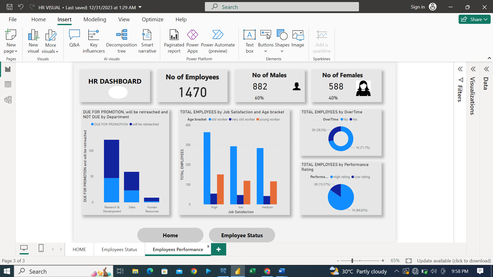

# HR-REPORT
## Introduction
Greetings from the fascinating field of data analysis! Using the extensive Adventure Works dataset, we do a thorough analysis of employee in this documentation. Our analysis seeks to provide important patterns and insights from the data, illuminating employee behavior, advancement, and reduction. Come along on this trip with us as we work our way through the numbers to uncover insights that might inform strategy and improve employee productivity.
## DATA SOURCE
You can access the  data to this project [HERE](https://www.youtube.com/watch?v=gFKNSmO8oyA)
## TASK
1.	AGE TREND: The proportion of workers at varying employment levels based on gender and age.
2.	WORKFORCE ANALYSIS: The number of workers in each job category who will be promoted and laid off.
3.	BENEFICIARIES: Recognizing employees which are due for both promotion and retrenchment which are meant to get benefit from the organization.
4.	PERFORMANCE ANALYSIS: Performance Analysis: Highlighting the productivity of employees in terms of working overtime and performance rating.
## DATA PREPARATION AND TRANSFORMATION 
I took care to include crucial calculations that would support our research when I organized the tables. These computations comprised important metrics such as the total number of workers, the proportion of men and women, the number of workers who are due for promotion and those who are not, the number of workers who are scheduled for layoffs and those who will continue to work, and the age range of workers. Including these computations was a wise decision because it provided us with more methods to interpret the data and extract relevant information. An extensive summary of the number of male and female employees correlated with job level and age group was produced during the visualization process. Using a doughnut chart, the amount of employees who will be promoted, not be promoted, laid off, and remain on service is shown on a card. The calculated number of employee to remain on service and to the retrenched are added as tooltip on the bar chat of the age bracket and total employee to display number of employee that will be retrenched in each age bracket. 

 I included a navigation button after realizing that it could be necessary to address issues with employee performance and transition (promotion and retrenchment). This button display the numbers and  names of employee that will be promoted, retrenched and employee that will get benefit because they are due for both promotion and retrenchment in each job role.

 

 ## EMPLOYEE PERFORMANCE REPORT
Employee performance was visualized in order to shed light on a number of factors, including overtime, performance ratings, and work satisfaction. This graphic displays the number of workers who put in extra time, the number of workers who perform well and poorly, and the number of workers who are happy in their positions.

## RECOMMENDATION
Old workers in level 2 have high job satisfaction and very old workers in level 5 have low job satisfaction, improvement should be done on their working conditions and policies.  more in-depth surveys or interviews to gather qualitative insights into the reasons behind satisfaction or dissatisfaction should consider.
Employees slated for promotion outnumber those not slated for promotion by a significant margin. In order to accommodate more employees, the standards and procedures for promotion should be revised. The managers high percentage of retrenchment of 43%, the decision's metric has to be updated.
Employee high performance rating is 84%. In order to optimize their strengths and attract more employees with excellent performance ratings, the employee should receive every possible encouragement. Additionally, boosting the number of workers who put in overtime can help boost production, which could be accomplished by raising the benefits associated with it.
